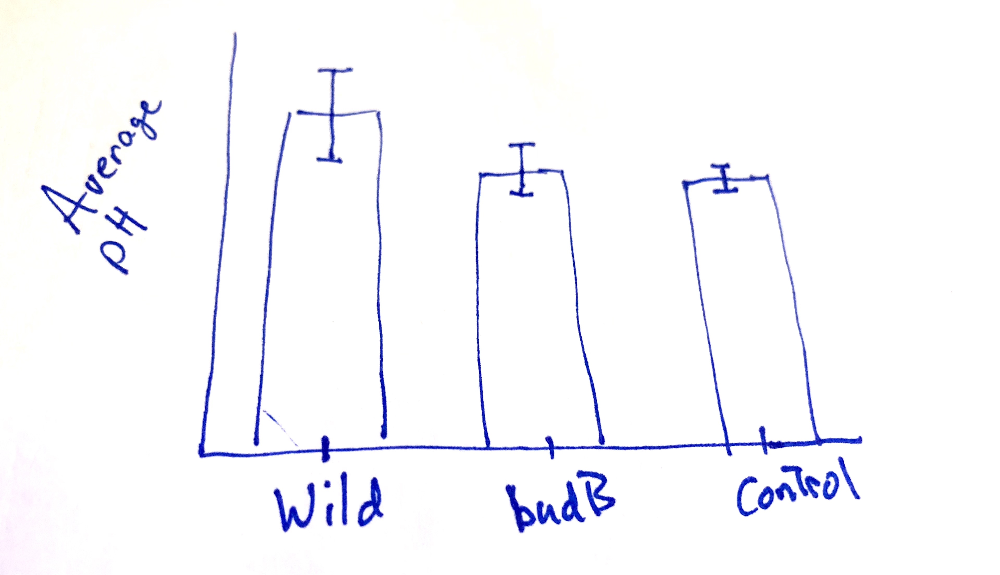

```{r setup, include=FALSE}
library(learnr)
library(dplyr)
library(ggplot2)
library(tidyr)
# library(patchwork)
knitr::opts_chunk$set(echo = FALSE)
experiment <- read.csv('data/experiment_data.csv', header = T)
```


## Understanding the experimental data
In this lesson, we will learn how to create an important plot for visualizing differences in an mean measurement across several groups.  To best understand the visual, we should understand the underlying experiment.  The data, and the description below, were generously provided by Dr. Grace Kwan.

#### Abstract

*Pectobacterium carotovorum is a commonly found bacterial pathogen that rots plant tissues. You have probably seen P. carotovorum in action if you have ever left some fresh produce in the refrigerator too long and came back to a slimy, watery mess. This bacterium uses enzymes to break down plant cell walls, causing the plant cells to burst from osmotic pressure and release all of their water and nutrients -- nutrients that support the continued growth of the bacterial pathogen.*

*Enzymes typically have optimal pH at which they work best. Above or below this optimal pH, the enzyme's activity diminishes. Pathogens may need to regulate the pH of their environment in order to ensure that their enzymes function optimally. *

*This experiment assessed the importance of environmental pH on the ability of P. carotovorum to break down plant tissues (i.e., rot them). P. carotovorum uses the BudB protein to limit acid production by providing an alternate fermentation pathway that results in a product of neutral pH.*

### Experiment details
The experiment monitored several lettuce leaves within each treatment class:

* Three control leaves without bacteria (`Control`)
* Nine leaves inoculated with wild-type P. carotovorum (`Wild`), and
* Nine leaves inoculated with $\Delta$budB mutant (`budB`).

At 24, 48, and 72 hours, disease progression was monitored as the size of the soft rot area. At the conclusion of the experiment, 72 hrs, the soft rotted tissue was mashed up to evaluate the pH.


### Exploring the data
Run the code block below to become familiar with the data, as well as the format of the data.  We store the information in the `experiment` data frame. Remember you can use "Next" button in the lower left to see more rows of the data.
```{r explore-p1, exercise = TRUE, exercise.lines=3}
experiment
```

```{r var-questions}
question("Which variables appear in our data frame? *Select all that apply.*",
    answer("Leaf_ID"),
    answer("pH", correct = TRUE),
    answer("Treatment", correct = TRUE),
    answer("Time", correct = TRUE),
    answer("Length_lesion"),
    answer("Final_pH"),
    allow_retry = T,
    random_answer_order = T,
    incorrect = paste(random_encouragement(),"Look at the column headings of the data frame after running the code above this question."),
    post_message = random_praise()
  )
```


```{r why-NA}

question_text(
  "In your own words, describe why the `pH` values are `NA` unless our time measurement equals \"72hr\".  Write a sentence before revealing the answer below.<br></br> *Ready to see an explanation?* (***Note***: all responses are marked as correct, so please compare your answer to ours!) <br></br> Submit your sentence to see an example written by us!",
  answer_fn(function(value) {
    if (grepl(".*", value)) {
      correct("Great work! How does your explanation compare with ours?")
    }
  }), message="The pH was not measured until the *end of the experiment*, so only when `Time` equals \"72hr\".  At \"24hr\" or \"48hr\", the measurement value is `NA` to indicate we did not take a measurement at those times."
)

```


### Great work so far!
Now that we are acquainted (or re-acquainted) with the data, we can turn to the task at hand.  We want to visualize the average `pH` of the lettuce leaves at the end of our experiment, but we want to break the leaves into groups by the `Treatment` variable.  In addition, we wish to have our visual convey a sense the variation we saw *within* the groups. 

In the next section, we will present a common plot for accomplishing the goals above, and then spend the rest of the lesson learning how to make this plot using `dplyr` and `ggplot2` in R!

Ready to get started?

***

*Quick Remarks:* For those new to `ggplot2`, we recommend this brief lesson (LINK HERE!!!!).  There is also a nice lesson on summary tables using `dplyr` here (LINK HERE !!!!).


## Planning our plot
Your co-author asks whether you can build the following plot in `ggplot2`; she provides a quick, hand-drawn sketch:

<center></center>

To translate a plot into `ggplot()` code, we start by considering two questions:

1. What aesthetics, `aes()` will we need? 
2. What geometries, `geom_*()`, appear?

### Aesthetics
Getting started with the aesthetics is easiest because our axes will always be part of the aesthetics. Looking at how the axes are labeled, we can surmise:

* `x`: The $x$-axis aesthetic will be our `Treatment` variable, because our group classifications appear as the labels along the axis.
* `y`: The $y$-axis aesthetic is trickier.  Notice it is labeled with ***average*** `pH`.  Average pH is related to, *but not the same as* the `pH` measurement. 

> **Important Idea:** Because the `y` aesthetic reports the average (or mean) pH, we will need to use a data frame that has the average pH per group as a variable (or column).

We can do this by summarizing our `experiment` data frame, but before we jump to this let's continue planning our plot.

### Geometries
Notice that the "content" (loosely speaking, the drawing in the middle of the plot) consists of

* bars (or columns), which represent the average pH. (`geom_bar()` or `geom_col()`)
* error-bars, which give us a sense of the variation *within* the `Treatment` groups. (`geom_errorbar()`)

To correctly plot the `geom_errorbar()`, our data frame would have to include the following for each group:

* `ymin`: the value for the lowest part of the error bar,
* `ymax`: the value for the upper part where the error bar stops.

To determine the start and stop values of the error-bars, we will use a (mean $\pm$ 2*std.dev) approach to determine these values.^[This is inspired by confidence intervals for the population mean based on a sample mean, but the results are unofficial.]

### Keep on going!
Hopefully, the recipe for constructing this plot is starting to take form.  In the remaining sections, we will

1. Prepare a data frame from `experiment` that has the information we need to create the plot; we'll call it `plot_df`.
2. Use `plot_df` to set up the axes and plot the columns;
3. Finish with the error-bars and add some finishing touches (like labels and titles). 

Ready to get plotting?


## Preparing a plotting data frame {data-progressive=TRUE}
Having surveyed the plot we want to build, we can now describe the data frame we would need to use for plotting.  Make sure each of the requirements below make sense to you!

1. Since we are dealing with `pH`, which was only measured at the end of the experiment, we need to `filter()` to only keep rows where `Time` equals "72hr".
2. Because of our axis aesthetics, we need to `group_by()` the `Treatment` variable, and `summarize()` to get the mean `pH` for each group.
3. Since we'll be using `geom_errorbar()`, we also need to add columns (using `mutate()`) for where the error bars will start and stop: mean $\pm$ 2*std.dev.

### Step 1: filtering
Recall that we only want rows where `Time` equals (`==`) the "72hr" mark.  Use the code chunk below, with the `filter` command, to do this and check your work by sifting through the data frame.
```{r filter, exercise = TRUE, exercise.lines=3}
experiment %>%
    filter(...)
```
```{r filter-hint-1}
experiment %>%
    filter(Time ...)
```
```{r filter-hint-2}
experiment %>%
    filter(Time == "...")
```
```{r filter-solution}
experiment %>%
    filter(Time == "72hr")
```


### Step 2: summarizing by group
Now that we have filtered our data frame, we can begin creating the summary data we need to create our plot.  Since we want to compute summaries for each `Treatment` group, we need to

1. Take our data frame and `group_by()` the `Treatment` variable, then
2. `summarize()` the appropriate variable (`pH`) using `R` functions

In particular, we will need the `mean()` function and the `sd()` function to compute the mean and standard deviation of the `pH` variable.

#### Exercise: summary statistics for pH
Build on the `dplyr` pipe that filters the data frame. Add the appropriate `group_by()` and `summarize()` code to create the summary measurements described above.  Use the following names for these variables: `average_pH` and `std.dev_pH`.

```{r group-by, exercise = TRUE, exercise.lines=6}
experiment %>% 
    filter(Time=="72hr") %>%
    group_by(...) %>%
    summarize(...)
```
```{r group-by-hint-1}
experiment %>% 
    filter(Time=="72hr") %>%
    group_by(Treatment) %>%
    summarize(...)
```
```{r group-by-hint-2}
experiment %>% 
    filter(Time=="72hr") %>%
    group_by(Treatment) %>%
    summarize(average_pH = ..., # write your computation
            std.dev_pH = ...   # write your computation
             )
```
```{r group-by-solution}
experiment %>% 
    filter(Time=="72hr") %>%
    group_by(Treatment) %>%
    summarize(average_pH = mean(pH), # write your computation
            std.dev_pH = sd(pH)   # write your computation
             )
```

### Step 3: adding variables for the error-bars
We are almost done preparing our data for the `ggplot()` we are designing. Our last task is to add to our data frame of summary statistics (mean and std. deviation).  Recall that `mutate(new_var = values)` is our method for creating new variables.  Specifically, we want to add

* `low`: a value for the lower end of our error-bar, created by taking `average_pH - 2*std.dev_pH`; and
* `high`: a value for the lower end of our error-bar, created by taking `average_pH + 2*std.dev_pH`

#### Exercise: adding `low` and `high` variables to our summary table.
Fill in the `mutate()` code below, which we added to our work from the previous two sections.
```{r mutate, exercise = TRUE, exercise.lines=9}
experiment %>% 
    filter(Time=="72hr") %>%
    group_by(Treatment) %>%
    summarize(average_pH = mean(pH),
            std.dev_pH = sd(pH)) %>%
    mutate(...)
```
```{r mutate-hint-1}
experiment %>% 
    filter(Time=="72hr") %>%
    group_by(Treatment) %>%
    summarize(average_pH = mean(pH),
            std.dev_pH = sd(pH)) %>%
    mutate(low = ...,
           high = ...)
```
```{r mutate-hint-2}
experiment %>% 
    filter(Time=="72hr") %>%
    group_by(Treatment) %>%
    summarize(average_pH = mean(pH),
            std.dev_pH = sd(pH)) %>%
    mutate(low = average_pH - 2*std.dev_pH,
           high = ...)
```
```{r mutate-solution}
experiment %>% 
    filter(Time=="72hr") %>%
    group_by(Treatment) %>%
    summarize(average_pH = mean(pH),
            std.dev_pH = sd(pH)) %>%
    mutate(low = average_pH - 2*std.dev_pH,
           high = average_pH + 2*std.dev_pH)
```

### Amazing!
The data frame we created over the three sections contains all the information we need to pass to `ggplot()` in order to create our visual.  In the next two sections, we will build our plot in stages.

Onward!


## Incrementally building our plot {data-progressive=TRUE}
Before continuing, it helps to save the summary data frame we created for plotting purposes.  The code below accomplishes this by adding a `-> plot_df` to the last line of the code. This essentially saves our work under the name `plot_df`, so that we can reference it later.
```
experiment %>% 
    filter(Time=="72hr") %>%
    group_by(Treatment) %>%
    summarize(average_pH = mean(pH),
            std.dev_pH = sd(pH)) %>%
    mutate(low = average_pH - 2*std.dev_pH,
           high = average_pH + 2*std.dev_pH) -> plot_df
```

### Start the plot.
Equipped with `plot_df`, we are ready to start creating out plot.  As a brief reminder, remember our general syntax is 
```
ggplot(data = df_name, 
       aes(x = ..., y = ..., ...))
```
where 

* `df_name` is the data frame from which we pull our information
* `aes()` sets our global aesthetics^[By "global aesthetics," we mean aesthetics that will apply to all the geometries we use.], like `x` for our $x$-axis and `y` for our $y$-axis, and potentially more.

#### Exercise: setting up axes.
Complete the code below to link our plot to `plot_df`, and set the `x` and `y` aesthetics.  Remember we want the treatment group on the $x$-axis and the average pH on the $y$-axis.
```{r axes-setup, include = FALSE}
experiment %>% 
    filter(Time=="72hr") %>%
    group_by(Treatment) %>%
    summarize(average_pH = mean(pH),
            std.dev_pH = sd(pH)) %>%
    mutate(low = average_pH - 2*std.dev_pH,
           high = average_pH + 2*std.dev_pH) -> plot_df
```

```{r axes, exercise = TRUE, exercise.lines=4}
ggplot(data = ...,
       aes(x = ...,
           y = ...))
```
```{r axes-hint-1}
ggplot(data = plot_df,
       aes(x = ...,
           y = ...))
```
```{r axes-hint-2}
ggplot(data = plot_df,
       aes(x = Treatment,
           y = ...))
```
```{r axes-solution}
ggplot(data = plot_df,
       aes(x = Treatment,
           y = average_pH))
```

### Exercise: adding the first geometry
Now that the axes are set up, we can add our first geometry.  Remember that the bars in our sketch reflected the average pH of each Treatment group. Our $x$ and $y$ aesthetics are already set up, so we simply need to add the geometry.

In this case, we will use `geom_col()` as our geometry.^[The `geom_bar()` geometry also creates a bar plot, but it is designed specifically to work with categorical data and do aggregation automatically so that you do not need to summarize before sending the data to the ggplot commands.] Add the code below!

```{r geom-bar, exercise = TRUE, exercise.lines=5, exercise.setup="axes-setup"}
# add the geometry to the code below
ggplot(data = plot_df,
       aes(x = Treatment,
           y = average_pH)) 
```
```{r geom-bar-hint-1}
ggplot(data = plot_df,
       aes(x = Treatment,
           y = average_pH)) +
    geom_...
```
```{r geom-bar-solution}
ggplot(data = plot_df,
       aes(x = Treatment,
           y = average_pH)) +
    geom_col()
```

### Adding error-bars
To show the variation within each treatment group, let's add the error-bars as prescribed by our `low` and `high` variables in `plot_df`. (Remember these represent (mean $\pm$ 2*std.dev) for the measurements within each group.)

The `geom_errorbar()` geometry requires some new aesthetics to work.  Since we have already set `x` when we created our axes, we need only specify two additional aesthetics to control where the error bars start and stop.  

* `ymin`: determines the bottom of the error bar (we will use `low` from `plot_df`)
* `ymax`: determines the top of the error bar (we will use `high` from `plot_df`)

We will also adjust the *width* of the error bars, because the default width is not good.  We do this by adding `width = ...` outside of the aesthetics, but still inside the error-bar geometry.

#### Exercise. 
Add `geom_errobar(aes(...), width = ...)` to the plot below, and 

* assign the `ymin` and `ymax` aesthetics to the variables `low` and `high`, respectively; and
* provide a value of 0.1 for the width.

This should add nice-looking error bars to our plot.

```{r error-bars, exercise = TRUE, exercise.lines=6, exercise.setup="axes-setup"}
# add the errobar geometry and the aesthetics
ggplot(data = plot_df,
       aes(x = Treatment,
           y = average_pH)) +
    geom_col()
```
```{r error-bars-hint-1}
ggplot(data = plot_df,
       aes(x = Treatment,
           y = average_pH)) +
    geom_col()+
    geom_errorbar(aes(ymin=..., ymax =...), width = ...)
```
```{r error-bars-hint-2}
ggplot(data = plot_df,
       aes(x = Treatment,
           y = average_pH)) +
    geom_col()+
    geom_errorbar(aes(ymin=low, ymax =high), width = ...)
```
```{r error-bars-solution}
ggplot(data = plot_df,
       aes(x = Treatment,
           y = average_pH)) +
    geom_col()+
    geom_errorbar(aes(ymin=low, ymax =high), width = 0.1)
```


### Adding a *fill*-color by Treatment
Suppose we want some color in the plot; specifically, we would like each treatment group to be a different color.

Since the `fill` color will depend on the `Treatment` variable, this is a new aesthetic! As such, it must appear inside `aes()`. While there are many places we can put this aesthetic,^[We could place `fill=Treatment` in with the `x` and `y` aesthetics in the `ggplot(...)` part of this plot] we will put it inside the `geom_col()` part of the plot.

```{r geom-color-bar, exercise = TRUE, exercise.lines=6, exercise.setup="axes-setup"}
# add the fill aesthetic to the code below
ggplot(data = plot_df,
       aes(x = Treatment,
           y = average_pH)) +
    geom_col(aes( ... ))+
    geom_errorbar(aes(ymin=low, ymax =high), width = 0.1)
```
```{r geom-color-bar-hint-1}
ggplot(data = plot_df,
       aes(x = Treatment,
           y = average_pH)) +
    geom_col(aes(fill= ... ))+
    geom_errorbar(aes(ymin=low, ymax =high), width = 0.1)
```
```{r geom-color-bar-solution}
ggplot(data = plot_df,
       aes(x = Treatment,
           y = average_pH)) +
    geom_col(aes(fill=Treatment))+
    geom_errorbar(aes(ymin=low, ymax =high), width = 0.1)
```

#### Great work!
We have an excellent working plot right now, and it looks even better than your co-author's drawing (no offense). There are a few tweaks, however, that might make it better.  In the last section, we demonstrate some finishing touches!

Ready to wrap it up?


## Finalizing the plot {data-progressive=TRUE}
Here is our plot so far
```{r fig.align='center',fig.width=5,fig.height=2.5}
experiment %>% 
    filter(Time=="72hr") %>%
    group_by(Treatment) %>%
    summarize(average_pH = mean(pH),
            std.dev_pH = sd(pH)) %>%
    mutate(low = average_pH - 2*std.dev_pH,
           high = average_pH + 2*std.dev_pH) -> plot_df
ggplot(data = plot_df,
       aes(x = Treatment,
           y = average_pH)) +
    geom_col(aes(fill=Treatment))+
    geom_errorbar(aes(ymin=low, ymax =high), width = 0.1)
```

We want to make two modifications:

1. We want better axis labels and a title; specifically, we want 
    * the $y$-axis to be "Average pH" and 
    * a title of "Leaf pH at 72 hours by Treatment."
2. We want the $y$-axis to have markings for every unit of pH (i.e., it should be labeled 0, 1, 2, ...7).

The first modification is straightforward, and simply involves adding `labs()` to the plot with arguments for `y` and `title`.  The second, involves *scaling* one of our aesthetics, namely `y`, which we can accomplish with `scale_y_continuous()`, since pH is measured on a continuous scale.

### Adding axis labels and a title
Let's take care of our labels and title first. Run the code below to see what it does, and then modify the code to provide the appropriate labels and title.
```{r labels, exercise = TRUE, exercise.lines=8, exercise.setup="axes-setup"}
# add the fill aesthetic to the code below
ggplot(data = plot_df,
       aes(x = Treatment,
           y = average_pH)) +
    geom_col(aes( fill=Treatment ))+
    geom_errorbar(aes(ymin=low, ymax =high), width = 0.1)+
    labs(y="new y axis", title = "this is on top")
```
```{r labels-hint-1}
ggplot(data = plot_df,
       aes(x = Treatment,
           y = average_pH)) +
    geom_col(aes( fill=Treatment ))+
    geom_errorbar(aes(ymin=low, ymax =high), width = 0.1)+
    labs(y="Average pH", title = "...")
```
```{r labels-solution}
ggplot(data = plot_df,
       aes(x = Treatment,
           y = average_pH)) +
    geom_col(aes( fill=Treatment ))+
    geom_errorbar(aes(ymin=low, ymax =high), width = 0.1)+
    labs(y="Average pH", title = "Leaf pH at 72 hours by Treatment")
```

### Scaling the $y$-axis
When scaling a continuous aesthetic, like `y` which records pH, we use the following
```
scale_y_continuous(breaks = vector_of_labels)
```
The `breaks` argument allows us to choose which labels we want to appear on the axis. However, we do need to provide these as a vector of numbers.  To accomplish this, I recommend using the `seq()` function.  Run the code below to get a sense of how it works.
```{r sequence, exercise=TRUE, exercise.lines=2}
seq(0, 7, by = 0.5)
```
*What code would give us a vector containing 0, 1, 2, ..., 7?* Use the code-chunk above to figure this out, because you will need it in the next exercise!

#### Exercise: adding $y$-axis labels.
For our last exercise, add the `scale_y_continuous(breaks=...)` code to the plot. Fill in the `...` with the appropriate code to generate a our labels from 0 to 7.
```{r scale-y, exercise = TRUE, exercise.lines=9, exercise.setup="axes-setup"}
# add the fill aesthetic to the code below
ggplot(data = plot_df,
       aes(x = Treatment,
           y = average_pH)) +
    geom_col(aes( fill=Treatment ))+
    geom_errorbar(aes(ymin=low, ymax =high), width = 0.1)+
    labs(y="Average pH", title = "Leaf pH at 72 hours by Treatment")
```
```{r scale-y-hint-1}
ggplot(data = plot_df,
       aes(x = Treatment,
           y = average_pH)) +
    geom_col(aes(fill= fill=Treatment ))+
    geom_errorbar(aes(ymin=low, ymax =high), width = 0.1)+
    labs(y="Average pH", title = "Leaf pH at 72 hours by Treatment")+
    scale_y_continuous(breaks = ...)
```
```{r scale-y-hint-2}
ggplot(data = plot_df,
       aes(x = Treatment,
           y = average_pH)) +
    geom_col(aes(fill= fill=Treatment ))+
    geom_errorbar(aes(ymin=low, ymax =high), width = 0.1)+
    labs(y="Average pH", title = "Leaf pH at 72 hours by Treatment")+
    scale_y_continuous(breaks = seq(...))
```
```{r scale-y-solution}
ggplot(data = plot_df,
       aes(x = Treatment,
           y = average_pH)) +
    geom_col(aes(fill=Treatment))+
    geom_errorbar(aes(ymin=low, ymax =high), width = 0.1)+
    labs(y="Average pH", title = "Leaf pH at 72 hours by Treatment")+
    scale_y_continuous(breaks = seq(0,7,by = 1))
```

***
***

***Excellent work!***

You have created a publication worthy plot of the experiment data.  The next section is a conclusion where we wrap up some of our ideas, offer some alternative plots for this data, and present all the code we generated!

Continue on to review!


## Conclusions
Notes, comments, summaries.

#### Steps for making plot

1. prepare the data frame
2. set up axes and link plotting data
3. add geometries and potentially new aesthetics
4. scale aesthetics
5. add labels

#### More options for this data!
There is always more than one way to visualize data. Here are a few other options that might be decent choices for this experiment and its results.  Code for these plots can be found here (INSERT LINK HERE !!!)

```{r, echo=FALSE}
radioButtons("plot_nm","Choose a plot!",
             c("Original Plot" = "p1",
                 "Plot 1" = "p2",
                 "Plot 2" = "p3",
                 "Plot 3" = "p4",
               "Plot 4" = "p5",
               "Plot 5" = "p6"),
             inline=TRUE)
plotOutput("distPlot")
```

```{r, context="server"}
# preparing the plot data frame
experiment %>% 
    filter(Time=="72hr")->exp2
experiment %>% 
    filter(Time=="72hr") %>%
    group_by(Treatment) %>%
    summarize(average_pH = mean(pH),
            std.dev_pH = sd(pH)) %>%
     mutate(low = average_pH - 2*std.dev_pH,
           high = average_pH + 2*std.dev_pH) -> plot_df
           
# Creating our plot
g1<-ggplot(data = plot_df,     
       aes(x = Treatment, y = average_pH))+
    geom_col(aes(fill = Treatment))+
    geom_errorbar(aes(ymin = low, ymax = high), width = 0.1)+
    labs(y="Average pH", title = "Leaf pH at 72 hours by Treatment")+
    scale_y_continuous(breaks = seq(0,7,by = 1))
g2<-ggplot(data = plot_df,     
       aes(x = Treatment, y = average_pH))+
    geom_col(aes(fill = Treatment),alpha = .6)+
    geom_errorbar(aes(ymin = low, ymax = high), width = 0.1)+
    labs(y="Average pH", title = "Leaf pH at 72 hours by Treatment")+
    scale_y_continuous(breaks = seq(0,7,by = 1))

p1<-g1 + scale_fill_brewer(palette="Accent")+theme_bw()+labs(title="Adjust color schemes with `brewer`")
p2<-g2 + geom_point(data = exp2,
                    aes(x=Treatment,y=pH,fill=Treatment),
                    position=position_jitter(width=.2),
                    pch = 21)+labs(y="pH",title="Overlay data to visualize individual values in each group",subtitle = "(Columns indicate the mean pH for each group.)")
p3<-ggplot(data = exp2,     
       aes(x = Treatment, y = pH))+
    geom_boxplot()+
    geom_violin(aes(fill = Treatment),alpha = .3,color=NA)+
    labs(y="pH", title = "Mix boxplots and violin plots to see the\ndistributions by treatment group")+
    scale_y_continuous(breaks = seq(0,7,by = 1))+theme_bw()

p4<-ggplot(data = plot_df,     
       aes(x = Treatment, y = average_pH))+
    geom_errorbar(aes(ymin = low, ymax = high,color=Treatment), width = 0.5,linewidth=.7)+
    geom_point(aes(fill = Treatment),pch = 21,size=3)+
    labs(y="Average pH", title = "Confidence intervals only")+
    scale_y_continuous(limits=c(3,7),breaks = seq(3,7,by = 1))+theme_bw()

measurement_type.labs<-c("Lesion Length (mm)","pH")
names(measurement_type.labs)<-c("Lesion.mm","pH")
experiment %>%
    filter(Time=="72hr") %>%
    pivot_longer(
        cols=c("Lesion.mm","pH"),
        names_to="measurement_type",
        values_to="measurements"
    ) %>% 
    ggplot(data = .,
           aes(x = Treatment,
               y=measurements))+
    geom_boxplot(aes(fill=Treatment),alpha=.3,colour=NA)+
    geom_point(alpha=.3, position=position_jitter(width=.2))+
    geom_segment(data = experiment %>%
                    filter(Time=="72hr") %>%
                    pivot_longer(
                        cols=c("Lesion.mm","pH"),
                        names_to="measurement_type",
                        values_to="measurements"
                    ) %>%
                     group_by(measurement_type,Treatment) %>%
                     summarise(meanMeas = mean(measurements)),
                 aes(x = rep(c(2,3,1)-.4,2), xend = rep(c(2,3,1)+.4,2), y = meanMeas, yend=meanMeas,color=Treatment))+
    facet_grid(rows=vars(measurement_type),
               scales="free_y",
               labeller = labeller(measurement_type=measurement_type.labs))+
    labs(y="",title="Comparing endpoint metrics of pH and Lesion length (mm)",
         subtitle="Bars represent means, boxes cover the interquartile range.")+
    theme_bw()+theme(legend.position = "none") -> p5

output$distPlot <- renderPlot({
  if (input$plot_nm=="p1"){
      g1
  } else if (input$plot_nm=="p2"){
      p1
  } else if (input$plot_nm=="p3"){
      p4
  } else if (input$plot_nm=="p4"){
      p2
  } else if (input$plot_nm=="p5"){
      p3
  } else {
      p5
  }
})
```


(PROVIDE GITHUB LINKS TO CODE FOR EACH PLOT)

Links to related exercises and resources.

### All the code together
```
# preparing the plot data frame
experiment %>% 
    # keep only rows at the final time point (i.e., the end)
    filter(Time=="72hr") %>%
    
    # We want summaries for each treatment group, so we
    # group by Treatment
    group_by(Treatment) %>%
    
    # Now we make our summaries, mean and std. deviation
    summarize(average_pH = mean(pH),
            std.dev_pH = sd(pH)) %>%
            
    # We need to add two new variables to control the 
    # start and stop heights of our error-bars.
    mutate(low = average_pH - 2*std.dev_pH,
           high = average_pH + 2*std.dev_pH) -> plot_df
           
    # The ->plot_df saves our work under the name plot_df
    
# Creating our plot
ggplot(data = plot_df,      # link to our plotting data
       # set our axis aesthetics
       aes(x = Treatment, y = average_pH))+
       
    # add the column geometry for the bars, 
    # the fill aesthetic chooses a new color for each 
    # treatment group.
    
    geom_col(aes(fill = Treatment))+
    
    # add the errorbars, using the ymin and ymax aesthetics
    # we use width = 0.1 to adjust the width of the error-bars
    
    geom_errorbar(aes(ymin = low, ymax = high), width = 0.1)+
    
    # add y-axis label and title
    
    labs(y="Average pH", title = "Leaf pH at 72 hours by Treatment")+
    
    # use breaks to define how we want to label the markings
    # on the y-axis
    
    scale_y_continuous(breaks = seq(0,7,by = 1))
    
# All set!
```


