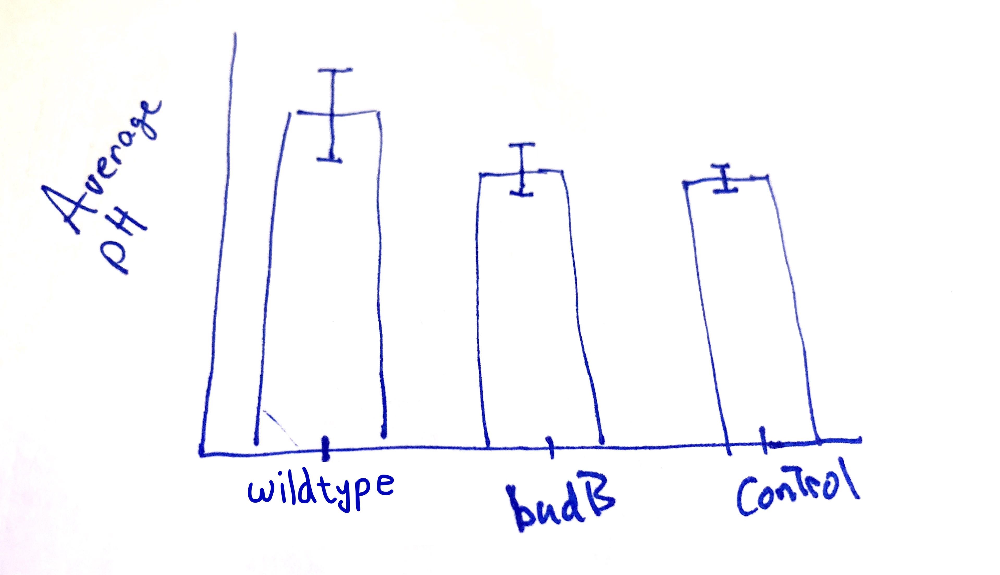

```{r setup, include=FALSE}
library(learnr)
library(dplyr)
library(ggplot2)
knitr::opts_chunk$set(echo = FALSE)
experiment <- read.csv('data/experiment_data.csv', header = T)
```


## Understanding the experimental data
In this lesson, we will learn how to create an important plot for visualizing differences in an mean measurement across several groups.  To best understand the visual, we should understand the underlying experiment.  The data, and the description below, were generously provided by Dr. Grace Kwan.

#### Abstract

*Pectobacterium carotovorum is a commonly found bacterial pathogen that rots plant tissues. You have probably seen P. carotovorum in action if you have ever left some fresh produce in the refrigerator too long and came back to a slimy, watery mess. This bacterium uses enzymes to break down plant cell walls, causing the plant cells to burst from osmotic pressure and release all of their water and nutrients -- nutrients that support the continued growth of the bacterial pathogen.*

*Enzymes typically have optimal pH at which they work best. Above or below this optimal pH, the enzyme's activity diminishes. Pathogens may need to regulate the pH of their environment in order to ensure that their enzymes function optimally. *

*This experiment assessed the importance of environmental pH on the ability of P. carotovorum to break down plant tissues (i.e., rot them). P. carotovorum uses the BudB protein to limit acid production by providing an alternate fermentation pathway that results in a product of neutral pH.*

### Experiment details
The experiment monitored several lettuce leaves within each treatment class:

* Three control leaves without bacteria (`Control`)
* Nine leaves inoculated with wild-type P. carotovorum (`Wild`), and
* Nine leaves inoculated with $\Delta$budB mutant (`budB`).

At 24, 48, and 72 hours, disease progression was monitored as the size of the soft rot area. At the conclusion of the experiment, 72 hrs, the soft rotted tissue was mashed up to evaluate the pH.


### Exploring the data
Run the code block below to become familiar with the data, as well as the format of the data.  We store the information in the `experiment` data frame. Remember you can use "Next" button in the lower left to see more rows of the data.
```{r explore-p1, exercise = TRUE, exercise.lines=3}
experiment
```

```{r var-questions}
question("Which variables appear in our data frame? *Select all that apply.*",
    answer("Leaf_ID"),
    answer("pH", correct = TRUE),
    answer("Treatment", correct = TRUE),
    answer("Time", correct = TRUE),
    answer("Length_lesion"),
    answer("Final_pH"),
    allow_retry = T,
    random_answer_order = T,
    incorrect = paste(random_encouragement(),"Look at the column headings of the data frame after running the code above this question."),
    post_message = random_praise()
  )
```


```{r why-NA}
question("In your own words, describe why the `pH` values are `NA` unless our time measurement equals \"72hr\".  Write a sentence before revealing the answer below.<br> *Ready to see an explanation?*",
answer("Yes.", correct = TRUE),
post_message = "The pH was not measured until the *end of the experiment*, so only when `Time` equals \"72hr\".  At \"24hr\" or \"48hr\", the measurement value is `NA` to indicate we did not take a measurement at those times."
)
```


### Great work so far!
Now that we are acquainted (or re-acquainted) with the data, we can turn to the task at hand.  We want to visualize the average `pH` of the lettuce leaves at the end of our experiment, but we want to break the leaves into groups by the `Treatment` variable.  In addition, we wish to have our visual convey a sense the variation we saw *within* the groups. 

In the next section, we will present a common plot for accomplishing the goals above, and then spend the rest of the lesson learning how to make this plot using `dplyr` and `ggplot2` in R!

Ready to get started?

***

*Quick Remarks:* For those new to `ggplot2`, we recommend this brief lesson (LINK HERE!!!!).  There is also a nice lesson on summary tables using `dplyr` here (LINK HERE !!!!).


## Planning our plot
Your co-author asks whether you can build the following plot in `ggplot2`; she provides a quick, hand-drawn sketch:

<center></center>

To translate a plot into `ggplot()` code, we start by considering two questions:

1. What aesthetics, `aes()` will we need? 
2. What geometries, `geom_*()`, appear?

### Aesthetics
Getting started with the aesthetics is easiest because our axes will always be part of the aesthetics. Looking at how the axes are labeled, we can surmise:

* `x`: The $x$-axis aesthetic will be our `Treatment` variable, because our group classifications appear as the labels along the axis.
* `y`: The $y$-axis aesthetic is trickier.  Notice it is labeled with ***average*** `pH`.  Average pH is related to, *but not the same as* the `pH` measurement. 

> **Important Idea:** Because the `y` aesthetic reports the average (or mean) pH, we will need to use a data frame that has the average pH per group as a variable (or column).

We can do this by summarizing our `experiment` data frame, but before we jump to this let's continue planning our plot.

### Geometries
Notice that the "content" (loosely speaking, the drawing in the middle of the plot) consists of

* bars (or columns), which represent the average pH. (`geom_bar()` or `geom_col()`)
* error-bars, which give us a sense of the variation *within* the `Treatment` groups. (`geom_errorbar()`)

To correctly plot the `geom_errorbar()`, our data frame would have to include the following for each group:

* `ymin`: the value for the lowest part of the error bar,
* `ymax`: the value for the upper part where the error bar stops.

To determine the start and stop values of the error-bars, we will use a (mean $\pm$ 2*std.dev) approach to determine these values.^[This is inspired by confidence intervals for the population mean based on a sample mean, but the results are unofficial.]

### Keep on going!
Hopefully, the recipe for constructing this plot is starting to take form.  In the remaining sections, we will

1. Prepare a data frame from `experiment` that has the information we need to create the plot; we'll call it `plot_df`.
2. Use `plot_df` to set up the axes and plot the columns;
3. Finish with the error-bars and add some finishing touches (like labels and titles). 

Ready to get plotting?

## Preparing a plotting data frame
Having surveyed the plot we want to build, we can now describe the data frame we would need to use for plotting.  Make sure each of the requirements below make sense to you!

1. Since we are dealing with `pH`, which was only measured at the end of the experiment, we need to `filter()` to only keep rows where `Time` equals "72hr".
2. Because of our axis aesthetics, we need to `group_by()` the `Treatment` variable, and `summarize()` to get the mean `pH` for each group.
3. Since we'll be using `geom_errorbar()`, we also need to add columns (using `mutate()`) for where the error bars will start and stop: mean $\pm$ 2*std.dev.

### Exercise: filtering
Recall that we only want rows where `Time` equals (`==`) the "72hr" mark.  Use the code chunk below, with the `filter` command, to do this and check your work by sifting through the data frame.
```{r filter, exercise = TRUE, exercise.lines=3}
experiment %>%
    filter(...)
```
```{r filter-hint-1}
experiment %>%
    filter(Time ...)
```
```{r filter-hint-2}
experiment %>%
    filter(Time == "...")
```
```{r filter-solution}
experiment %>%
    filter(Time == "72hr")
```


## Summarizing by group
Now that we have filtered our data frame, we can begin creating the summary data we need to create our plot.  Since we want to compute summaries for each `Treatment` group, we need to

1. Take our data frame and `group_by()` the `Treatment` variable, then
2. `summarize()` the appropriate variable (`pH`) using `R` functions

In particular, we will need the `mean()` function and the `sd()` function to compute the mean and standard deviation of the `pH` variable.

### Exercise: summary statistics for pH
Build on the `dplyr` pipe that filters the data frame. Add the appropriate `group_by()` and `summarize()` code to create the summary measurements described above.
```{r group-by, exercise = TRUE, exercise.lines=6}
experiment %>% 
    filter(Time=="72hr") %>%
    group_by(...) %>%
    summarize(...)
```
```{r group-by-hint-1}
experiment %>% 
    filter(Time=="72hr") %>%
    group_by(Treatment) %>%
    summarize(...)
```
```{r group-by-hint-2}
experiment %>% 
    filter(Time=="72hr") %>%
    group_by(Treatment) %>%
    summarize(average_pH = ..., # write your computation
            std.dev_pH = ...   # write your computation
             )
```
```{r group-by-solution}
experiment %>% 
    filter(Time=="72hr") %>%
    group_by(Treatment) %>%
    summarize(average_pH = mean(pH), # write your computation
            std.dev_pH = sd(pH)   # write your computation
             )
```

## Adding variables for the error-bars
We are almost done preparing our data for the `ggplot()` we are designing. Our last task is to add to our data frame of summary statistics (mean and std. deviation).  Recall that `mutate(new_var = values)` is our method for creating new variables.  Specifically, we want to add

* `low`: a value for the lower end of our error-bar, created by taking `average_pH - 2*std.dev_pH`; and
* `high`: a value for the lower end of our error-bar, created by taking `average_pH + 2*std.dev_pH`

### Exercise: adding `low` and `high` variables to our summary table.
Fill in the `mutate()` code below, which we added to our work from the previous two sections.
```{r mutate, exercise = TRUE, exercise.lines=9}
experiment %>% 
    filter(Time=="72hr") %>%
    group_by(Treatment) %>%
    summarize(average_pH = mean(pH),
            std.dev_pH = sd(pH)) %>%
    mutate(...)
```
```{r mutate-hint-1}
experiment %>% 
    filter(Time=="72hr") %>%
    group_by(Treatment) %>%
    summarize(average_pH = mean(pH),
            std.dev_pH = sd(pH)) %>%
    mutate(low = ...,
           high = ...)
```
```{r mutate-hint-2}
experiment %>% 
    filter(Time=="72hr") %>%
    group_by(Treatment) %>%
    summarize(average_pH = mean(pH),
            std.dev_pH = sd(pH)) %>%
    mutate(low = average_pH - 2*std.dev_pH,
           high = ...)
```
```{r mutate-solution}
experiment %>% 
    filter(Time=="72hr") %>%
    group_by(Treatment) %>%
    summarize(average_pH = mean(pH),
            std.dev_pH = sd(pH)) %>%
    mutate(low = average_pH - 2*std.dev_pH,
           high = average_pH + 2*std.dev_pH)
```

### Amazing!
The data frame we created over the three sections contains all the information we need to pass to `ggplot()` in order to create our visual.  In the next two sections, we will build our plot in stages.

Onward!

## Incrementally building our plot
Before continuing, it helps to save the summary data frame we created for plotting purposes.  The code below accomplishes this by adding a `-> plot_df` to the last line of the code. This essentially saves our work under the name `plot_df`, so that we can reference it later.
```
experiment %>% 
    filter(Time=="72hr") %>%
    group_by(Treatment) %>%
    summarize(average_pH = mean(pH),
            std.dev_pH = sd(pH)) %>%
    mutate(low = average_pH - 2*std.dev_pH,
           high = average_pH + 2*std.dev_pH) -> plot_df
```

### Start the `ggplot()` with `data =` and `aes()`thetics
Equipped with `plot_df`, we are ready to start creating out plot.  As a brief reminder, remember our general syntax is 
```
ggplot(data = df_name, 
       aes(x = ..., y = ..., ...))
```
where 

* `df_name` is the data frame from which we pull our information
* `aes()` sets our global aesthetics, like `x` for our $x$-axis and `y` for our $y$-axis, and potentially more.

#### Exercise: setting up axes.
Complete the code below to link our plot to `plot_df`, and set the `x` and `y` aesthetics.  Remeber we want the treatment group on the $x$-axis and the average pH on the $y$-axis.
```{r axes-setup, inclue = FALSE}
experiment %>% 
    filter(Time=="72hr") %>%
    group_by(Treatment) %>%
    summarize(average_pH = mean(pH),
            std.dev_pH = sd(pH)) %>%
    mutate(low = average_pH - 2*std.dev_pH,
           high = average_pH + 2*std.dev_pH) -> plot_df
```

```{r axes, exercise = TRUE, exercise.lines=4}
ggplot(data = ...,
       aes(x = ...,
           y = ...))
```
```{r axes-hint-1}
ggplot(data = plot_df,
       aes(x = ...,
           y = ...))
```
```{r axes-hint-2}
ggplot(data = plot_df,
       aes(x = Treatment,
           y = ...))
```
```{r axes-solution}
ggplot(data = plot_df,
       aes(x = Treatment,
           y = average_pH))
```

### Exercise: adding the first geometry


## Adding error-bars, finishing touches
* add error-bars, 
* start y-axis at zero (`scale_y_continuous(limits=c(0,6.5))`)

#### `scale_*` your `aes()`thetics 

## Finalizing the plot

#### Some other adjustments

#### Add a title and axis labels with `labs()`

#### Optional: overlay the data!

## Review Exercises

## Optional: Modified versions of this plot
Show a few variations, highlighting changes made in the code to create the modifications:

