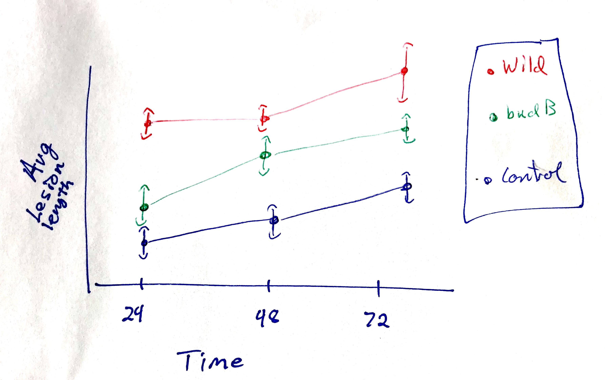

```{r setup, include=FALSE}
library(learnr)
library(dplyr)
library(ggplot2)
knitr::opts_chunk$set(echo = FALSE)
experiment <- read.csv('data/experiment_data.csv', header = T)
```


## Understanding the experiment
In this lesson, we will learn how to create an important plot for visualizing the progression in a mean measurement across time for several groups.  To best understand the visual, we should understand the underlying experiment.  The data, and the description below, were generously provided by Dr. Grace Kwan.

#### Abstract

*Pectobacterium carotovorum is a commonly found bacterial pathogen that rots plant tissues. You have probably seen P. carotovorum in action if you have ever left some fresh produce in the refrigerator too long and came back to a slimy, watery mess. This bacterium uses enzymes to break down plant cell walls, causing the plant cells to burst from osmotic pressure and release all of their water and nutrients -- nutrients that support the continued growth of the bacterial pathogen.*

*Enzymes typically have optimal pH at which they work best. Above or below this optimal pH, the enzyme's activity diminishes. Pathogens may need to regulate the pH of their environment in order to ensure that their enzymes function optimally. *

*This experiment assessed the importance of environmental pH on the ability of P. carotovorum to break down plant tissues (i.e., rot them). P. carotovorum uses the BudB protein to limit acid production by providing an alternate fermentation pathway that results in a product of neutral pH.*

### Experiment details
The experiment monitored several lettuce leaves within each treatment class:

* Three control leaves without bacteria (`Control`)
* Nine leaves inoculated with wild-type P. carotovorum (`Wild`), and
* Nine leaves inoculated with $\Delta$budB mutant (`budB`).

At 20, 50, and 100 hours, disease progression was monitored as the length of the soft rot area in millimeters (`Lesion.mm`).

### Exploring the data
Run the code block below to become familiar with the data, as well as the format of the data.  We store the information in the `experiment` data frame. Remember you can use "Next" button in the lower left to see more rows of the data.
```{r explore-p1, exercise = TRUE, exercise.lines=3}
experiment
```

```{r var-questions}
question("We are primarily interested in how the length of the soft rot area changes over time, and whether these time-progressions are different for each treatment group.<br> With that in mind, which variables from our data frame will be necessary for our plot? *Select all that apply.*",
    answer("Leaf_ID"),
    answer("pH"),
    answer("Treatment", correct = TRUE),
    answer("TimeValue", correct = TRUE),
    answer("Lesion.mm",correct = TRUE),
    answer("Sample"),
    allow_retry = T,
    random_answer_order = T,
    incorrect = paste(random_encouragement(),"Look at the column headings of the data frame after running the code above this question."),
    post_message = random_praise()
  )
```

### Great work so far!
Now that we are acquainted (or re-acquainted) with the data, we can turn to the task at hand.  We want to visualize how the average lesion length for each treatment group changes over time.  In addition, we wish to have our visual convey a sense the variation we saw *within* the groups at different times. 

In the next section, we will present a common plot for accomplishing the goals above, and then spend the rest of the lesson learning how to make this plot using `dplyr` and `ggplot2` in R!

Shall we get started?

***

*Quick Remarks:* For those new to `ggplot2`, we recommend this brief lesson (LINK HERE!!!!).  There is also a nice lesson on summary tables using `dplyr` here (LINK HERE !!!!).


## Planning our plot
Your co-author asks whether you can build the following plot in `ggplot2`; she provides a quick, hand-drawn sketch:

<center></center>

To translate a plot into `ggplot()` code, we start by considering two questions:

1. What aesthetics, `aes()`, will we need? 
2. What geometries, `geom_*()`, appear?

### Aesthetics
Getting started with the aesthetics is easiest because our axes will always be part of the aesthetics. Looking at how the axes are labeled, we can surmise:

* `x`: The $x$-axis aesthetic will be our `Treatment` variable, because our group classifications appear as the labels along the axis.
* `y`: The $y$-axis aesthetic is trickier.  Notice it is labeled with ***average*** Lesion Length.  Average lesion length is related to, *but not the same as* the `Lesion.mm` measurement. 

> **Important Idea:** Because the `y` aesthetic reports the average (or mean) of `Lesion.mm`, we will need to use a data frame that has contains this average as a variable for each group *and at each time point*.

* `color`: The point-line elements in the plot are organized by color, which depends on `Treatment`.  This will also need to be an aesthetic because it depends on data.

We can do this by grouping and summarizing our `experiment` data frame, but before we jump to this let's continue planning our plot.

### Geometries
Notice that the "content" (loosely speaking, the drawing in the middle of the plot) consists of

* **points**, which represent the average lesion length. (`geom_point()`)
* **lines**, which connect the average lesion lengths. (`geom_line()`)
* **error-bars**, which give us a sense of the variation *within* the `Treatment` groups at each time point. (`geom_errorbar()`)

To correctly plot the `geom_errorbar()`, our data frame needs to include have to include the following for each group *and each time point*:

* `ymin`: the value for the lowest part of the error bar,
* `ymax`: the value for the upper part where the error bar stops.

To determine the start and stop values of the error-bars, we will use a (mean $\pm$ 2*std.dev) approach to determine these values.^[This is inspired by confidence intervals for the population mean based on a sample mean, but the results are unofficial.]

### Keep on going!
Hopefully, the recipe for constructing this plot is starting to take form.  In the remaining sections, we will

1. Prepare a data frame from `experiment` that has the information we need to create the plot; we'll call it `plot_df`.
2. Use `plot_df` to set up the axes, and then plot the lines and points.
3. Finish with the error-bars and add some final touches (like labels and titles). 

Let's go!


## Preparing a plotting data frame {data-progressive=TRUE}
Having understood and processed the plot we want to build, we can now describe the data frame we would need to use for plotting.  Make sure each of the requirements below make sense to you!

1. Because of our $y$-axis aesthetic, which is an average, we will need to `group_by()` the `Treatment` variable, and `summarize()` to get the mean `Lesion.mm` for each group.
2. Because our $x$-axis aesthetic involves multiple time points, we will actually need the summaries described in (1) above *for each time point*: 20, 50, and 100 hours.  We can accomplish this by adding `TimeValue` to the `group_by()` function.
3. Since we'll be using `geom_errorbar()`, we also need to add columns (using `mutate()`) for where the error bars will start and stop: mean $\pm$ 2*std.dev. These variables will need to have this information for each group at each time point.

With this in mind, our plotting data frame should have four variables:

* `Treatment`: indicating the treatment group for that row
* `TimeValue`: indicating the time point for that row

(*Note:* there will be enough rows to cover each treatment group at each of the time points)

* `average.Lesion.mm`: measuring the average lesion length at that time point for the given treatment group.
* `stddev.Lesion.mm`: measuring the standard deviation of the lesion lengths at that time point for the given treatment group.
* `low`: the lower limit of a confidence interval (`mean - 2*std.dev`), which we will use for the start of our error bars; again, this is associated to a specific group at a specific time.
* `high`: the upper limit of a confidence interval (`mean + 2*std.dev`), which we will use for the end of our error bars; again, this is associated to a specific group at a specific time.

### Step 1: grouping and summarizing
We can begin creating the summary data we need to for our plot.  Since we want to compute summaries for each `Treatment` group at each `TimeValue`, we need to

1. Take our data frame and `group_by()` the `Treatment` and `TimeValue` variables, then
2. `summarize()` the appropriate variable (`Lesion.mm`) using `R` functions.

In particular, we will need the `mean()` function and the `sd()` function to compute the mean and standard deviation of the `Lesion.mm` variable.

#### Exercise: summary statistics for lesion length
Build on the `dplyr` pipe that filters the data frame. Add the appropriate `group_by()` and `summarize()` code to create the summary measurements described above.  Use the following names for these variables: `average.Lesion.mm` and `stddev.Lesion.mm`.

```{r group-by, exercise = TRUE, exercise.lines=6,message=FALSE}
experiment %>% 
    group_by(...) %>%
    summarize(...)
```
```{r group-by-hint-1}
experiment %>% 
    group_by(Treatment, ...) %>%
    summarize(...)
```
```{r group-by-hint-2}
experiment %>% 
    group_by(Treatment, TimeValue) %>%
    summarize(average.Lesion.mm = ..., # write your computation
            stddev.Lesion.mm = ...   # write your computation
             )
```
```{r group-by-solution}
experiment %>% 
    group_by(Treatment, TimeValue) %>%
    summarize(average.Lesion.mm = mean(Lesion.mm), 
            stddev.Lesion.mm = sd(Lesion.mm)
             )
```

*Data Check:* Look at the data frame.  Does it have one row for each treatment group at each time point? (This is 9 rows in total, since we have 3 groups at 3 time points.) 

### Step 2: adding variables for the error-bars
We are almost done preparing our data for the `ggplot()` we are designing. Our last task is to add to our data frame of summary statistics (mean and std. deviation).  Recall that `mutate(new_var = values)` is our method for creating new variables.  Specifically, we want to add

* `low`: a value for the lower end of our error-bar, created by taking `average.Lesion.mm - 2*stddev.Lesion.mm`; and
* `high`: a value for the lower end of our error-bar, created by taking `average.Lesion.mm - 2*stddev.Lesion.mm`

(*Note:* Make a footnote that mean - 2*stdev approximates a 95\% confidence interval well enough in most cases to not make a visual difference to the actual confidence.)

#### Exercise: adding `low` and `high` variables to our summary table.
Fill in the `mutate()` code below, which we added to our work from the previous two sections.
```{r mutate, exercise = TRUE, exercise.lines=7, message=FALSE}
experiment %>% 
    group_by(Treatment, TimeValue) %>%
    summarize(average.Lesion.mm = mean(Lesion.mm), 
            stddev.Lesion.mm = sd(Lesion.mm)) %>%
    mutate(...)
```
```{r mutate-hint-1}
experiment %>% 
    group_by(Treatment, TimeValue) %>%
    summarize(average.Lesion.mm = mean(Lesion.mm), 
            stddev.Lesion.mm = sd(Lesion.mm)) %>%
    mutate(low = ...,
           high = ...)
```
```{r mutate-hint-2}
experiment %>% 
    group_by(Treatment, TimeValue) %>%
    summarize(average.Lesion.mm = mean(Lesion.mm), 
            stddev.Lesion.mm = sd(Lesion.mm)) %>%
    mutate(low = average.Lesion.mm - 2*stddev.Lesion.mm,
           high = ...)
```
```{r mutate-solution}
experiment %>% 
    group_by(Treatment, TimeValue) %>%
    summarize(average.Lesion.mm = mean(Lesion.mm), 
            stddev.Lesion.mm = sd(Lesion.mm)) %>%
    mutate(low = average.Lesion.mm - 2*stddev.Lesion.mm,
           high = average.Lesion.mm + 2*stddev.Lesion.mm)
```

### Amazing!
The data frame we just created contains all the information we need to pass to `ggplot()` in order to create our visual.  In the next two sections, we will build our plot in stages.

Onward!

## Incrementally building our plot {data-progressive=TRUE}
Before continuing, it helps to save the summary data frame we created for plotting purposes.  The code below accomplishes this by adding a `-> plot_df` to the last line of the code. This essentially saves our work under the name `plot_df`, so that we can reference it later.
```
experiment %>% 
    group_by(Treatment, TimeValue) %>%
    summarize(average.Lesion.mm = mean(Lesion.mm), 
            stddev.Lesion.mm = sd(Lesion.mm)) %>%
    mutate(low = average.Lesion.mm - 2*stddev.Lesion.mm,
           high = average.Lesion.mm + 2*stddev.Lesion.mm) -> plot_df
```

### Start the plot.
Equipped with `plot_df`, we are ready to start creating out plot.  As a brief reminder, remember our general syntax is 
```
ggplot(data = df_name, 
       aes(x = ..., y = ..., ...))
```
where 

* `df_name` is the data frame from which we pull our information
* `aes()` sets our global aesthetics^[By "global aesthetics," we mean aesthetics that will apply to all the geometries we use.], like `x` for our $x$-axis and `y` for our $y$-axis, and potentially more.

#### Exercise: setting up axes.
Complete the code below to link our plot to `plot_df`, and set the `x`, `y`, and `color` aesthetics.  Remember we want the times on the $x$-axis, and the *average* lesion length on the $y$-axis, and the color should depend on the treatment group.
```{r axes-setup, include = FALSE}
experiment %>% 
    group_by(Treatment, TimeValue) %>%
    summarize(average.Lesion.mm = mean(Lesion.mm), 
            stddev.Lesion.mm = sd(Lesion.mm)) %>%
    mutate(low = average.Lesion.mm - 2*stddev.Lesion.mm,
           high = average.Lesion.mm + 2*stddev.Lesion.mm) -> plot_df
```

```{r axes, exercise = TRUE, exercise.lines=5}
ggplot(data = ...,
       aes(x = ...,
           y = ...,
           color = ...))
```
```{r axes-hint-1}
ggplot(data = plot_df,
       aes(x = ...,
           y = ...,
           color = ...))
```
```{r axes-hint-2}
ggplot(data = plot_df,
       aes(x = TimeValue,
           y = average.Lesion.mm,
           color = ...))
```
```{r axes-solution}
ggplot(data = plot_df,
       aes(x = TimeValue,
           y = average.Lesion.mm,
           color = Treatment))
```

### Exercise: adding the point and line geometries
Now that the axes are set up, we can add our first geometries.  Remember that the points in our sketch reflected the average lesion length of each Treatment group, and the lines connected them at different time points. We have taken our best guess at the aesthetics, so let's try adding the geometries.

In this case, we will use `geom_point()` and `geom_line()` as our geometries. Add both of them to the code below!

(*Note*: you will get a plot, but not the one that you want! Don't panic :))

```{r geoms, exercise = TRUE, exercise.lines=8, exercise.setup="axes-setup"}
# add the geometry to the code below
ggplot(data = plot_df,
       aes(x = TimeValue,
           y = average.Lesion.mm,
           color = Treatment))
```
```{r geoms-hint-1}
ggplot(data = plot_df,
       aes(x = TimeValue,
           y = average.Lesion.mm,
           color = Treatment)) +
    geom_... +
    geom_...
```
```{r geoms-hint-2}
ggplot(data = plot_df,
       aes(x = TimeValue,
           y = average.Lesion.mm,
           color = Treatment)) +
    geom_point() +
    geom_...
```
```{r geoms-solution}
ggplot(data = plot_df,
       aes(x = TimeValue,
           y = average.Lesion.mm,
           color = Treatment)) +
    geom_point()+
    geom_line()
    
```

### One more aesthetic to fix the problem
The previous plot ***was wrong!*** (Gasp!).

Yes. This happens ***all the time*** when you are coding. That's why we build things incrementally; so we can error check and correct as we go.

Even though we added `geom_line()`, the plot did not contain any lines.  However, notice that we got an error message in return:

>**Error message:** `geom_line()`: Each group consists of only one observation. Do you need to adjust the group aesthetic?

What's the group aesthetic? Well, those that would like to read the [documentation for geom_line()](https://ggplot2.tidyverse.org/reference/geom_path.html) are welcome, but we will give you the quick answer. 

To get `geom_line()` to connect dots in the same **group**, we need to add `group = ...` as an aesthetic to our plot.

#### Exercise: connecting the dots
Add the group aesthetic to the code below, and see how it fixes our plot! Remember, we want to plot the lines based on the `Treatment` group.
```{r geoms-fixed, exercise = TRUE, exercise.lines=9, exercise.setup="axes-setup"}
# add the group aesthetic to the code below
ggplot(data = plot_df,
       aes(x = TimeValue,
           y = average.Lesion.mm,
           color = Treatment,
           group = ...))+
    geom_point() + 
    geom_line()
```
```{r geoms-fixed-solution}
ggplot(data = plot_df,
       aes(x = TimeValue,
           y = average.Lesion.mm,
           color = Treatment,
           group = Treatment))+
    geom_point() + 
    geom_line()
```


### Adding error-bars
To show the variation within each treatment group at each time point, let's add the error-bars as prescribed by our `low` and `high` variables in `plot_df`. (Remember these represent (mean $\pm$ 2*std.dev) for the measurements within each group at each time.)

The `geom_errorbar()` geometry requires some new aesthetics to work.  Since we have already set `x` when we created our axes, we need only specify two additional aesthetics to control where the error bars start and stop.  

* `ymin`: determines the bottom of the error bar (we will use `low` from `plot_df`)
* `ymax`: determines the top of the error bar (we will use `high` from `plot_df`)

We will also adjust the *width* of the error bars, because the default width is not good.  We do this by adding `width = ...` outside of the aesthetics, but still inside the error-bar geometry.

#### Exercise. 
Add `geom_errobar(aes(...), width = ...)` to the plot below, and 

* assign the `ymin` and `ymax` aesthetics to the variables `low` and `high`, respectively; and
* provide a value of 0.1 for the width.

This should add nice-looking error bars to our plot.

```{r error-bars, exercise = TRUE, exercise.lines=8, exercise.setup="axes-setup"}
# add the errobar geometry and the aesthetics
ggplot(data = plot_df,
       aes(x = TimeValue,
           y = average.Lesion.mm,
           color = Treatment,
           group = Treatment))+
    geom_point() + geom_line()
```
```{r error-bars-hint-1}
ggplot(data = plot_df,
       aes(x = TimeValue,
           y = average.Lesion.mm,
           color = Treatment,
           group = Treatment))+
    geom_point() + geom_line()+
    geom_errorbar(aes(ymin=..., ymax =...), width = ...)
```
```{r error-bars-hint-2}
ggplot(data = plot_df,
       aes(x = TimeValue,
           y = average.Lesion.mm,
           color = Treatment,
           group = Treatment))+
    geom_point() + geom_line()+
    geom_errorbar(aes(ymin=low, ymax =high), width = ...)
```
```{r error-bars-solution}
ggplot(data = plot_df,
       aes(x = TimeValue,
           y = average.Lesion.mm,
           color = Treatment,
           group = Treatment))+
    geom_point() + geom_line()+
    geom_errorbar(aes(ymin=low, ymax =high), width = 0.1)
```


#### Great work!
We have an excellent working plot right now, and it looks even better than your co-author's drawing (no offense). There are a few tweaks, however, that might make it better.  In the last section, we demonstrate some finishing touches!

Ready to wrap it up?


## Finalizing the plot {data-progressive=TRUE}
Here is our plot so far:
```{r fig.align='center',fig.width=5,fig.height=3.5, message = FALSE}
experiment %>% 
    group_by(Treatment, TimeValue) %>%
    summarize(average.Lesion.mm = mean(Lesion.mm), 
            stddev.Lesion.mm = sd(Lesion.mm)) %>%
    mutate(low = average.Lesion.mm - 2*stddev.Lesion.mm,
           high = average.Lesion.mm + 2*stddev.Lesion.mm) -> plot_df

ggplot(data = plot_df,
       aes(x = TimeValue,
           y = average.Lesion.mm,
           color = Treatment,
           group = Treatment))+
    geom_point() + geom_line()+
    geom_errorbar(aes(ymin=low, ymax =high), width = 0.1)
```

We want to make a few modifications:

1. We want better axis labels and a title; specifically, we want 
    * the $y$-axis to be "Average Lesion Length (mm)" and 
    * a title of "Rot lesion length as a function of time for three treatment groups".
    
2. The error-bars overlap, making it some of them hard to see. If we make them slightly transparent, we might be better able to track where there is overlap. (We supply more options in the conclusion.)

3. The gray background also makes it difficult to see the error-bars, so we want to make the background white.

The first modification is straightforward, and simply involves adding `labs()` to the plot with arguments for `y` and `title`.  The second requires adjusting the `alpha` value inside the error-bar geometry. The third we can accomplish very quickly by adding a "theme".

### Adding axis labels and a title
(*Note*: Do not add a title, not done in science.)
Let's take care of our labels and title first. Run the code below to see what it does, and then modify the code to provide the appropriate labels and title.
```{r labels, exercise = TRUE, exercise.lines=10, exercise.setup="axes-setup"}
# add labs() below to change the axis labels
ggplot(data = plot_df,
       aes(x = TimeValue,
           y = average.Lesion.mm,
           color = Treatment,
           group = Treatment))+
    geom_point() + geom_line()+
    geom_errorbar(aes(ymin=low, ymax =high), width = 0.1)
```
```{r labels-hint-1}
ggplot(data = plot_df,
       aes(x = TimeValue,
           y = average.Lesion.mm,
           color = Treatment,
           group = Treatment))+
    geom_point() + geom_line()+
    geom_errorbar(aes(ymin=low, ymax =high), width = 0.1)+
    labs(y="Average Lesion Length (mm)", 
         title = "...")
```
```{r labels-solution}
ggplot(data = plot_df,
       aes(x = TimeValue,
           y = average.Lesion.mm,
           color = Treatment,
           group = Treatment))+
    geom_point() + geom_line()+
    geom_errorbar(aes(ymin=low, ymax =high), width = 0.1)+
    labs(y="Average Lesion Length (mm)", 
         title = "Rot lesion length as a function of time for three treatment groups")
```

### Backgrounds and errorbars
In general, the `alpha = ...` setting inside a geometry will control the transparency of the `fill` or `color` aesthetic associated to the geometry. Values close to zero (like 0.1) are very see-through; whereas values close to 1 (like 0.9) are opaque.

#### Exercise: transparent error-bars and white background
To help us see the error-bar overlaps, let's make the transparency about 0.5. Set this parameter inside the error-bar geometry, but not in the `aes()` part.

```{r scale-y, exercise = TRUE, exercise.lines=11, exercise.setup="axes-setup"}
# add the fill aesthetic to the code below
ggplot(data = plot_df,
       aes(x = TimeValue,
           y = average.Lesion.mm,
           color = Treatment,
           group = Treatment))+
    geom_point() + geom_line()+
    geom_errorbar(aes(ymin=low, ymax =high), width = 0.1)+
    labs(y="Average Lesion Length (mm)", 
         title = "Rot lesion length as a function of time for three treatment groups")+
    theme_bw()
```
```{r scale-y-hint-1}
ggplot(data = plot_df,
       aes(x = TimeValue,
           y = average.Lesion.mm,
           color = Treatment,
           group = Treatment))+
    geom_point() + geom_line()+
    geom_errorbar(aes(ymin=low, ymax =high), width = 0.1,
                  alpha = ...)+
    labs(y="Average Lesion Length (mm)", 
         title = "Rot lesion length as a function of time for three treatment groups")+
    theme_bw()
```
```{r scale-y-solution}
ggplot(data = plot_df,
       aes(x = TimeValue,
           y = average.Lesion.mm,
           color = Treatment,
           group = Treatment))+
    geom_point() + geom_line()+
    geom_errorbar(aes(ymin=low, ymax =high), width = 0.1,
                  alpha = 0.3)+
    labs(y="Average Lesion Length (mm)", 
         title = "Rot lesion length as a function of time for three treatment groups")+
    theme_bw()
```
**Quick notes:**

* We added `theme_bw()` to the end of the plot. This is a special ggplot "theme" (see [more here](https://ggplot2.tidyverse.org/reference/ggtheme.html)) that comes equipped with a white background. 
* The transparency did not seem to make the error-bars easier to read. One might decide to skip that component. The white background does seem to help though! 

***
***

***Excellent work!***

You have created a publication worthy plot of the experiment data.  The next section is a conclusion where we wrap up some of our ideas, offer some alternative plots for this data, and present all the code we generated! 

Continue on to review!


## Conclusions
Notes, comments, summaries.

#### Steps for making plot

1. prepare the data frame
2. set up axes and link plotting data
3. add geometries and potentially new aesthetics
4. scale aesthetics
5. add labels

#### More options for this data!
There is always more than one way to visualize data. Here are a few other options that might be decent choices for this experiment and its results.  Code for these plots can be found here (INSERT LINK HERE !!!)

```{r, echo=FALSE}
radioButtons("plot_nm","Choose a plot!",
             c("Original Plot" = "p1",
                 "Plot 1" = "p2",
                 "Plot 2" = "p3",
                 "Plot 3" = "p4",
               "Plot 4" = "p5",
               "Plot 5" = "p6"),
             inline=TRUE)
plotOutput("distPlot")
```

```{r message = FALSE, context="server"}
# preparing the plot data frame
experiment %>% 
    group_by(Treatment, TimeValue) %>%
    summarize(average.Lesion.mm = mean(Lesion.mm), 
            stddev.Lesion.mm = sd(Lesion.mm)) %>%
    mutate(low = average.Lesion.mm - 2*stddev.Lesion.mm,
           high = average.Lesion.mm + 2*stddev.Lesion.mm) -> plot_df
           
p1<-ggplot(data = plot_df,
       aes(x = TimeValue,
           y = average.Lesion.mm,
           color = Treatment,
           group = Treatment))+
    geom_point() + geom_line()+
    geom_errorbar(aes(ymin=low, ymax =high), width = 0.1,
                  alpha = .5)+
    theme_bw()+
    labs(y="Average Lesion Length (mm)",
         title = "Rot lesion length as a function of time for three treatment groups")


p3<-ggplot(data = plot_df,
       aes(x = TimeValue,
           y = average.Lesion.mm,
           color = Treatment,
           group = Treatment))+
    geom_point() + geom_line()+
    geom_ribbon(aes(ymin=low, ymax =high, fill=Treatment),
                  alpha = .3)+
    theme_bw()+
    labs(y="Average Lesion Length (mm)",
         title = "Using 'ribbons' rather than error-bars")


p2<-ggplot(data = plot_df,
       aes(x = TimeValue,
           y = average.Lesion.mm,
           color = Treatment,
           group = Treatment))+
    geom_point(position=position_dodge(width=3)) + geom_line(position=position_dodge(width=3))+
    geom_errorbar(aes(ymin=low, ymax =high), width = 2,
                  alpha = .5, position=position_dodge(width=3))+
    theme_classic()+
    labs(y="Average Lesion Length (mm)",
         title = "Point, line, and error-bars \"dodged\" to avoid overlap")

p4<-ggplot(data = plot_df,
       aes(x = TimeValue,
           y = average.Lesion.mm,
           color = Treatment,
           group = Treatment))+
    geom_point(size = 3, pch = 23,aes(fill=Treatment),color='black',
               alpha=.8) + 
    geom_line()+
    geom_point(data = experiment,
               aes(x = TimeValue, y = Lesion.mm,
                   color=Treatment),
               pch = 19,alpha=.6,size=1,
               position=position_jitter(width=.05))+
    # geom_errorbar(aes(ymin=low, ymax =high), width = 0.1,
                  # alpha = .5)+
    theme_bw()+
    labs(y="Average Lesion Length (mm)",
         title = "Means plotted as diamonds, overlayed with data.")

# # Work on it
# ggplot(data = experiment,
#        aes(x = TimeValue,
#            y = Lesion.mm,
#            fill = Treatment))+
#     # geom_violin()+
#     geom_boxplot()+
#     # geom_errorbar(aes(ymin=low, ymax =high), width = 0.1,
#                   # alpha = .5)+
#     theme_bw()+
#     labs(y="Average Lesion Length (mm)",
#          title = "Rot lesion length as a function of TimeValue for three treatment groups")
library(forcats)
p5<-experiment %>%
    mutate(Treatment = fct_relevel(Treatment,"Control","budB")) %>%
ggplot(data = .,
       aes(x = TimeValue,
           y = Lesion.mm,
           group=as.factor(TimeValue)))+
    # geom_violin()+
    geom_boxplot(aes(fill=Treatment))+
    scale_x_continuous(breaks=c(20,50,100))+
    # geom_errorbar(aes(ymin=low, ymax =high), width = 0.1,
                  # alpha = .5)+
    facet_grid(cols=vars(Treatment))+
    theme_bw()+
    labs(y="Lesion Length (mm)",
         x="Time (hrs)",
         title = "Separate boxplots by Treatment, with time progression\ninside each subplot")

p6<-experiment %>%
    mutate(Treatment = fct_relevel(Treatment,"Control","budB")) %>%
ggplot(data = .,
       aes(x = TimeValue,
           y = Lesion.mm,
           fill=Treatment))+
    # geom_violin()+
    # Come back and fix
    geom_boxplot(aes(group=as.factor(TimeValue)),
                     color='gray1',alpha=.3,
                 outlier.shape=NA)+
    geom_point(aes(color=Treatment),pch=21,
               position=position_jitter(width=3))+
    # geom_errorbar(aes(ymin=low, ymax =high), width = 0.1,
                  # alpha = .5)+
    facet_grid(cols=vars(Treatment))+
    theme_bw()+
    labs(y="Lesion Length (mm)",
         title = "Boxplots with data overlayed")


output$distPlot <- renderPlot({
  if (input$plot_nm=="p1"){
      p1
  } else if (input$plot_nm=="p2"){
      p2
  } else if (input$plot_nm=="p3"){
      p3
  } else if (input$plot_nm=="p4"){
      p4
  } else if (input$plot_nm=="p5") {
      p5
  } else {
      p6
  }
})

```

(PROVIDE GITHUB LINKS TO CODE FOR EACH PLOT)

Links to related exercises and resources.

### All the code together
```
experiment %>% 
    # We need to group the data by Treatment AND Time,
    # Sinc we want to compare treatment groups at all
    # the time points
    group_by(Treatment, TimeValue) %>%
    
    # We create summaries, average and std deviation,
    # for our dependent variable Lesion.mm
    summarize(average.Lesion.mm = mean(Lesion.mm), 
            stddev.Lesion.mm = sd(Lesion.mm)) %>%
            
    # We add variable low and high to provide information
    # for where to start and stop our error bars
    mutate(low = average.Lesion.mm - 2*stddev.Lesion.mm,
           high = average.Lesion.mm + 2*stddev.Lesion.mm) -> plot_df
# -> plot_df just saves this output as plot_df.

#Let's begin our plot.
ggplot(data = plot_df,      # link to the data frame plot_df
       # We want TimeValue on the x axis, average lesion length on the y.
       aes(x = TimeValue,
           y = average.Lesion.mm,
           # The color aesthetic is for the point geometry,
           # each treatment group gets a unique color
           color = Treatment,
           # The group aesthetic is for the line geometry,
           # the lines will connect each treatment group
           group = Treatment))+
           
    # With our aesthetics set, we add the point and line geometries.
    geom_point() + geom_line()+
    
    # Next we add the errorbar geometry, with low and high
    # set to our ymin and ymax aesthetics.  Further, we 
    # adjust the width of the bar and the transparency (alpha).
    geom_errorbar(aes(ymin=low, ymax =high), width = 0.1,
                  alpha = .5)+
                  
    # Here we add better labels to our axes
    labs(y="Average Lesion Length (mm)",
         title = "Rot lesion length as a function of time for three treatment groups") +
         
    # And to finish, a theme with a white background to make
    # the error bars easier to see.
    theme_bw()
           
# All set!
```


